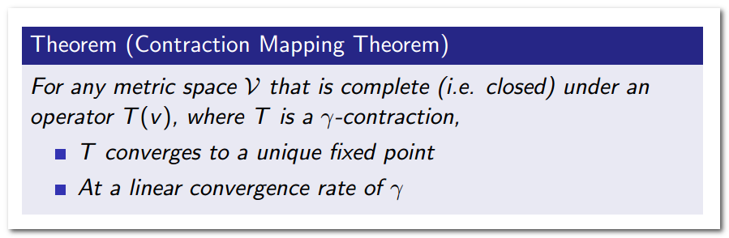

##强化学习笔记

@(强化学习)

[TOC]
###Lecture 1：Introduction to Reinforcement Learning

####1. 强化学习的相关内容

* 强化学习在不同领域有不同的表现形式：神经科学、心理学、计算机科学、工程领域、数学、经济学等有不同的称呼。

* 强化学习是机器学习的一个分支：监督学习、无监督学习、强化学习

* 强化学习的特点：
 * 没有监督数据、只有奖励信号
 * 奖励信号不一定是实时的，而很可能是延后的，有时甚至延后很多。
 * 时间（序列）是一个重要因素
 * 当前的行为影响后续接收到的数据 
####2. 强化学习中的Agent
#####2.1 Reward 奖励
&emsp; $R_t$是一个标量的信号反馈，它反映个体在t时刻做得怎么样。个体的工作就是最大化累计奖励。强化学习就是基于这样的”奖励假设”：所有问题解决的目标都可以被描述成最大化累积奖励。

#####2.2 Sequential Decision Making  序列决策
&emsp;  选择一定的行为系列以求最大化未来的总体奖励；这些行为可能是一个长期的序列；奖励可能而且通常是延迟的；有时候为了获取更多的长期奖励，宁愿牺牲即时（短期）的奖励。
#####2.3 Agent and Environment  个体和环境

在图片中，把大脑比作agent,把地球比作环境。
在 每一步行动中，agent：
* 做出一个行为 $A_t$，
* 外部世界观测的输入 $O_t$ ，
* 从环境得到一个奖励信号 $R_t$ 。

Environment：
* 接收个体的动作 $A_t$ ，
* 更新环境信息，同时使得个体可以得到下一个观测$O_{t+1}$，
* 给个体一个奖励信号 $R_{t+1} $。

&emsp; 通过agent和环境进行不断的交互，我们发现增强学习是基于观察、奖励、行动措施的时间序列。时间序列代表着agent的经验，这个经验就是我们用于增强学习的数据。因此增强学习的问题就是聚焦这个数据来源 ，也就是这个数据流,即图中的观察信息，采取的行动，以及奖励信号。
##### 2.4 History and State  历史和状态
######2.4.1  History  历史
history是采取行动，进行观察，获得奖励的序列 
 > $H_t=O_1,R_1,A_1,\ldots ,A_{t-1},O_t,R_t$
 
接下来会发生什么，完全依赖于history。agent挑选action依赖于history，environment会根据history发生变化，产生rewardas。
######2.4.2 State  状态
&emsp; state是对信息的总结，state决定了下一步的action。即state包含了我们需要的所有信息，通过这些信息，我们就可以采取下一步的action。state是关于history的函数：
>$S_t=f(H_t)$

(1)  Environment State 
&emsp; $S_t^e$是环境的私有呈现，包括环境用来决定下一个观测/奖励的所有数据，通常对个体并不完全可见，也就是个体有时候并不知道环境状态的所有细节。即使有时候环境状态对个体可以是完全可见的，这些信息也可能包含着一些无关信息。

(2)Agent State  
&emsp; $S_t^a$是个体的内部呈现，包括个体可以使用的、决定未来动作的所有信息。个体状态是强化学习算法可以利用的信息。这个state可以是任何关于history的函数：
> $ S_t^a=f(H_t)$

&emsp; 关于state的定义有两类，一类是environment state,另一类是agent state,现在用数学语言对state进行定义：

Markov性质是指下一时刻的状态仅有当前当前状态决定，与过去的状态无太大的关系：
> $H_{1:t} \longrightarrow S_t  \longrightarrow H_{t+1: \infty}$

######2.4.3 Fully Observable Environments  完全可观测的环境
Fully Observable: agengt可以直接观察到环境状态 ，即 ：
> $O_t=S_t^a=S_t^e$
>$agent &ensp;  state=environment &ensp; state=information  &ensp; state$

正式地说，这种问题是一个马儿可夫决策过程（Markov Decision Process， MDP）
######2.4.4 Partially Observable Environments  部分可观测的环境
Partial observability :agent不能直接观测环境，是间接的观测环境，所以它不能看到所有的环境信息。举几个例子：
* 一个带有摄像头的机器人并不确切的知道自己在哪里，只能通过摄像头来辨别出它在房间的什么位置，它需要自己进行定位 

* 贸易agent只能观测到最新的价格，她不知道价格的趋势，不知道这些来自哪里，它要做的是基于已有的信息采取下一步行动。
*  一个扑克牌玩家只能观测到那些已经打出的牌，其他牌都是面向桌面的。

从上面的例子我们可以看出：
> $agent&ensp; state\neq envirment &ensp; state$ 

&emsp;正式地说，这种问题是一个部分可观测马儿可夫决策过程。个体必须构建自己的状态表示$S_t^a$,我们有好多种方法创建$S_t^a$，现在介绍一种简单的方法: Complete history:$S_t^a=H_t$,就是记住每一件事，记住目前为止的每一次观测、动作、奖励。除此之外，我们还有其他办法：
* Beliefs of environment state: 这是一种有问题的贝叶斯问题方法，你不相信每一步都是正确的。你不知道环境发生了变化 ，你要对你身处的环境，引进概率分布：
 > $S_t^a=(P[S_t^e=s^1],\ldots,P[S_t^e=s^n])$

这个概率向量决定了状态，我们通过他来决定下一步的行动，所以我们要保存所有东西的概率值

* Recurrent neural network：不需要使用概率,只需要线性组合的形式，将最近的agents的状态与最近的观测结合起来，就能得到最新的状态：
 >$S_t^a=\sigma(S_{t-1}^aW_s+O_tW_o)$
#####2.5  Inside An RL Agnet  强化学习个体的主要组成部分
agent 包含三部分，这三个部分是agent的主要内容，单不是唯一。
* Policy: 策略，Policy表明了agent能够采取的 行动，它是一个行为函数，该函数以它的状态作为输入，以它的下一步的行动决策作为输出。
* Value function: 这个函数用来评估agent在某种特殊状态下的好坏，采取某种行动之后的好坏
* Model: agent用来感知环境是如何变化的，这里并不是真实的环境，而是在agent眼里的环境。model就是用来判断环境变化的。 

###### 2.5.1 Policy 策略
&emsp; policy是从state到action的一种映射。policy可以是确定性的，也可以是不确定性的。
&emsp; 在某种state下我们拥有确定的policy ，比如
> $a=\Pi(s)$
> 这里的函数$\Pi$告诉我们如何从某个情形的状态s变成某个行动a 

&emsp;此外，我们也可以使用随机的policy，我们的policy不一定是确定的函数，它们也可能具有随机性。这种随机函数可以帮助我们随机的指定决策，这样我们拥有更多的状态空间。例如：
> $\Pi(a|s)=P[A_t=a|S_t=s]$
> 在该状态下，某个动作action发生的概率，

######2.5.2  Value Function  价值函数
&emsp; Value Function是对未来奖励的预测，用来评价当前状态的好坏程度。当面对两个不同的状态时，个体可以用一个Value值来评估这两个状态可能获得的最终奖励区别，继而指导选择不同的行为，即制定不同的策略。同时，一个价值函数是基于某一个特定策略的，不同的策略下同一状态的价值并不相同。某一策略下的价值函数用下式表示：
> $v_{\Pi}(s)=E_{\Pi}[R_{t+1}+\gamma R_{t+2} \gamma^2R_{t+3}+\ldots |S_t=s]$

######2.5.3 Model  模型
&emsp; model 并不是环境本身,主要是用来预测下一步环境的变化，model主要包含两部分：transition model与reward model, transition model($P$)用来预测下个状态，预测环境的动态变化。 reward model($R$)用来估计我们得到的奖励。公式表示如下：
> 状态转换模型：$\mathcal {P_{ss'}^a}=P[S'=s'|S=s,A=a]$
> 这个模型告诉我们根据先前的的状态以及动作、所处的环境预测下一个状态的概率。
>Reward模型： $\mathcal{R_s^a}=E[R|S=s,A=a]$
>这个模型告诉我们预期的奖励是基于先前以及当下的状态

构建环境并不总是需要model这个环节。

#####2.6  agent 的分类
我们可以对增强学习进行分类，分类的依据是根据agent 是否包含policy、value、model这三个关键元素。 根据这个依据，可以分为分为三类：
1. Value Based  基于价值函数
 * No Policy (Implicit)
 * Value Function
2. Policy Based  基于策略函数
* Policy
* No Value Function
3. Actor Critic
* Policy
* Value Function

此外，在增强学习中，根据agent是否包含model分为两类:Model Free与Model Based
* Model Free
 * Policy and/or Value Function
 * No Model
* Model Based
 * Policy and/or Value Function
 * Model

下面通过一张图片来展示分类情况：

####3 强化学习的一些问题
#####3.1 Learning and Planning  学习和规划
* Reinforcement Learning:
环境初始时是未知的。它不知道环境，它需要与环境进行交互，不断地进行尝试，不断地进行学习，逐渐改善其行为策略，最终在环境中找到最好的方式采取行动，并最大化奖励。
* Planning  规划 
环境是已知的，我们的agent不需要与外部环境进行交互，agent根据这个环境的模型进行计算，然后改善policy,知道如何采取行动。

进行增强学习工作的第一步是学习环境是如何工作的，然后做规划，learning和planning 是相互关联的。
#####3.2  Exploration and Exploitation  探索和利用
&emsp; 强化学习是一种不断试错的模型，agent 需要从环境中获得一个最好的policy，这样在探索过程中就不会丢失太多的奖励。探索意味着发现更多的关于环境的信息，开发意味着开发利用你所找到的信息。我们需要平衡两者之间的关系，进而最大化我们的奖励。
#####3.3  Prediction and Control 预测和控制
* Prediction: 给定一个策略。遵循现有的策略，未来我会怎样做，做的怎么样。
* Control：找到最优的策略
###Lecture 2: Markov Decision Processes
#### 1. Markov Processes 马尔科夫过程
&emsp;  几乎所有的强化学习问题都可以用某些方式形式化为一个Markov Decision Process。例如：
* 优化控制问题，比如差分动力学，可以用一个连续的MDP解决
* 部分可观测问题可以转化为MDP
* Bandits：强化学习中探索和开发的困境，这是一种包含state的MDP
#####1.1 Markov Property 马尔科夫特性
&emsp; 如果一个state具有Markov Property,那就意味着未来的状态独立于过去的状态，它只与现在这一刻的状态有关。

&emsp;  具有Markov Property的state完全特征化了我们需要知道的一切，它从历史数据中捕获了所有的相关信息。一旦知道了当前时刻t,意味着你可以扔掉t时刻之前的Markov Process的集合，也就是拥有Markov Property的state的集合。在这样的环境中系统中所有你知道的可以用当前时刻下的特定的一个状态描述，不需要保留我们之前见过的一切。
#####1.2 State Transition Matrix  状态转移矩阵
&emsp; 对于任何拥有Markov Property的问题，对于任何的Markov Process，从某个state开始，可以得到一个后继状态s,这样就可以定义从一个状态转移到另一个状态的概率。公式定义如下：
> $\mathcal{P_{ss'}}=P[S_{t+1}=s'|S_t=s]$
> 注：状态s转移到状态s'的概率是：当处在时刻t,当前状态为s时，后继的state是随机出现的的某个特定状态s'的概率

&emsp;  我们要时刻记住当前的state特征化了接下来发生的一切，这就意味着一些良好定义的转移概率会告诉我：处于当前的state中，在这种状态下我将以一定的概率值转移到一定的后继状态，这就是状态转移率。
&emsp;  把状态转移矩阵存入矩阵，就得到了状态转移矩阵，状态转移矩阵的每一行都完全特征定制了在MDP中从任何一个可能的开始状态出发进行转移的过程和转移的概率；

#####1.3 Markov Process Definition   马尔可夫过程的定义
&emsp;  Markov Process基本上是一个随机的过程，有一个随机状态的序列，类似以随机的状态序列s1,s2……这个序列会具有Markov Property。

#####1.4 Example: Student Markov Chain   马尔可夫学生链

&emsp;图片中的序列来自与马尔科夫学生链中的动态采样,这也就意味着从随机的过程中得到一些随机的序列，该序列以一定的概率分布在序列上进行状态转移，这个序列具有Markov Property。
&emsp;图中圆圈表示学生所处的状态，方格Sleep是一个终止状态，或者可以描述成自循环的状态，也就是Sleep状态的下一个状态100%的几率还是自己。箭头表示状态之间的转移，箭头上的数字表示当前转移的概率。
&emsp;举例说明：当学生处在第一节课（Class1）时，他/她有50%的几率会参加第2节课（Class2）；同时在也有50%的几率不在认真听课，进入到浏览facebook这个状态中。在浏览facebook这个状态时，他/她有90%的几率在下一时刻继续浏览，也有10%的几率返回到课堂内容上来。当学生进入到第二节课（Class2）时，会有80%的几率继续参加第三节课（Class3），也有20%的几率觉得课程较难而退出（Sleep）。当学生处于第三节课这个状态时，他有60%的几率通过考试，继而100%的退出该课程，也有40%的可能性需要到去图书馆之类寻找参考文献，此后根据其对课堂内容的理解程度，又分别有20%、40%、40%的几率返回值第一、二、三节课重新继续学习。一个可能的学生马尔科夫链从状态Class1开始，最终结束于Sleep，其间的过程根据状态转化图可以有很多种可能性，这些都称为Sample Episodes。以下四个Episodes都是可能的：
>C1 - C2 - C3 - Pass - Sleep

>C1 - FB - FB - C1 - C2 - Sleep

>C1 - C2 - C3 - Pub - C2 - C3 - Pass - Sleep

>C1 - FB - FB - C1 - C2 - C3 - Pub - C1 - FB - FB - FB - C1 - C2 - C3 - Pub - C2 - Sleep

该学生马尔科夫过程的状态转移矩阵如下图：

状态转移矩阵基本告诉我们，对于我们可能位于的任何state,我们会以多大的概率转移到另外的任一状态。它充分的描述了整个系统的动态过程

####2.  Markov Reward Processes 马尔科夫奖励过程 
#####2.1 Definition 定义
&emsp;Markov Reward Process是带有value判断的Markov Process。除了Markov Process中的状态空间 $\mathcal {S}$ 和转移状态$\mathcal{P}$,再添加reward function (奖励函数)$\mathcal{R}$discount factor(衰减因子)$\mathcal{\gamma}$。$\mathcal{R}$告诉我们当前时刻的这一步，我们在时间T，状态s的时候，时间T加1，可以获得的reward。衰减因子$\gamma \in [0,1]$,David列举了不少原因来解释为什么引入衰减系数，其中有数学表达的方便，避免陷入无限循环，远期利益具有一定的不确定性，符合人类对于眼前利益的追求，符合金融学上获得的利益能够产生新的利益因而更有价值等等。

##### 2.2 Return 收获
&emsp; 收获 $G_{t} $为在一个马尔科夫奖励链上从t时刻开始往后所有的奖励的有衰减的总和。其中衰减系数体现了未来的奖励在当前时刻的价值比例，在k+1时刻获得的奖励$\mathcal{R}$在t时刻的体现出的价值是 $\gamma^k R$ ，$\gamma$接近0，则表明趋向于“近视”性评估；$\gamma$接近1则表明偏重考虑远期的利益。
 
##### 2.3 Value Function 价值函数
&emsp;  价值函数是指从某一具体的状态s下，我们能得到多少value，能得到的reward总和是多少，在给定的state下说明它有多好。

举例说明收获和价值的计算：

#####2.4 Bellman Equation  贝尔曼方程
######2.4.1 Bellman Equation for MRPs
Bellman方程的基本思想是对value function进行递归分解，主要分为两部分：
* immediate reward$\mathcal R_{t+1}$(即将得到的)
* discounted value of successor state $\mathcal {\gamma v}(S_{t+1})$(后继state的一个状态到结束状态的value）

backup diagrams:可以看做是向前看一步的探索过程。如果当前我们处于状态s,
那么我们可以向前看一步，得到后继状态s'。当然我们可以得到状态的value函数。

###### 2.4.2 Bellman Equation for Student MRP
&emsp; 选中一个state，它的value函数的值是4.3。那么，使用Bellman方程来验证这个值。Value 函数应该等价于 向前看了一步，算的是接下来所有可能发生的事得到期望值。从C3出发，有两件事可能发生。首先得到-2分的Reward，这个值是固定的，无论接下来发生什么，都会有得到这个Reward。然后，我们有0.6的概率到达一个value值为10的地方，也有0.4的概率达到pub,pub的value值是0.8,将这些所有的值都加起来，得到-2+0.6*10+0.4*0.8=4.3，结果得到了验证，这确实是MDP的得分。

######2.4.3  Bellman Equation in Matrix Form   矩阵形式的Bellman方程
Bellman方程可以用矩阵和向量的形式表示：
> $v=\mathcal R+\gamma \mathcal Pv$

具体如下：

$\mathcal R$代表的是immediate reward,$\gamma \mathcal Pv$代表的是终止状态的value。
######2.4.4 Solving the Bellman Equation
Bellman方程是线性方程，所以方程可以被显性的求解：

直接求解方程只适用于小规模的MRPs，对于大规模的MRPs这不是一个典型的可操作性强的解决方法。因为如果有n个状态，那么对矩阵求逆的复杂度 是$O(n^3)$,复杂度过高。对于大规模的MRP我们也有许多有效的方法可以提供：
* Dynamic programming   动态规划
* Monte-Carlo evaluation   蒙特卡罗评估
* Temporal-Difference learning 时许差分学习

#### 3. Markov Decision Processes 马尔科夫决策过程
#####3.1 MDP
######3.1.1  Definition 定义
&emsp;相对于马尔科夫奖励过程，马尔科夫决定过程多了一个行为集合A，它是这样的一个元组: $<\mathcal{S, A, P, R}, γ>$。看起来很类似马尔科夫奖励过程，但这里的$\mathcal{P}$和$\mathcal{R}$都与具体的行为a对应，而不像马尔科夫奖励过程那样仅对应于某个状态，A表示的是有限的行为的集合。具体的定义如下：

######3.1.2  Example: Student MDP
&emsp;下图给出了一个可能的MDP的状态转化图。图中红色的文字表示的是采取的行为，而不是先前的状态名。对比之前的学生MRP示例可以发现，即时奖励与行为对应了，同一个状态下采取不同的行为得到的即时奖励是不一样的。在下图中，如果选择了去酒吧，那么之后出现的state就是随机的了，你可以选择回到第一讲，或者是回到第二讲，或者是第三讲。 现在对于你所要走的路径有了更多的控制权，这个一个agent所面临过的实际情况。现在的目标是在决策的过程中，找到一条最佳的路径，这条路径可以最大化你得到的reward。

#####3.2 Policies
&emsp;策略$ \pi$是在给定states的情况下，一个关于actions的概率分布。其元素 $\pi(a|s)$ 为对过程中的某一状态$s$采取可能的行为$a$的概率。用 $\pi(a|s) $表示。

&emsp; 一个策略完整定义了个体的行为方式，也就是说定义了个体在各个状态下的各种可能的行为方式以及其概率的大小。Policy仅和当前的状态有关，与历史信息无关；现在我们只考虑静态的policies，也就是所，在MDP中，不管我们在那个时间步(到达这个状态)，我们所采取的措施都是一样的。policy所依赖的唯一一个因素是我们当前所处的state ，跟时间步无关。在MRP和MDP中，Markov property意味着state s完全特征化了从这个state开始以后的演化过程。
&emsp;当给定一个MDP:$ \mathcal{M} = <\mathcal{S, A, P, R,} \gamma>$ 和一个策略$\pi$时，我们遵循一个特定的流程，抽取得到一个特定的states序列 $S_{1},S_{2},... $，这个序列就是一个是Markov chain,这个过程是一个马尔科夫过程$ <S, P^{\pi}>$ ；同样，状态和奖励序列$ S_{1}, R_{2}, S_{2}, R_{3}, S_{3}, ... $是一个马尔科夫奖励过程 $<S, P^{\pi}, R^{\pi}, \gamma> $，并且在这个奖励过程中满足下面两个方程：
> $$\mathcal{P_{ss'}^{\pi}}=\sum_{a\in A}\pi(a|s)\mathcal{P_{ss'}^a}$$
> $$\mathcal{R_s^{\pi}}=\sum_{a\in A}\pi(a|s)\mathcal{R_s^a}$$

 &emsp;在执行策略$ \pi $时，状态从s转移至 s' 的概率等于一系列概率的和，这一系列概率指的是在执行当前策略时，执行某一个行为的概率与该行为能使状态从s转移至s’的概率的乘积。
&emsp;当前状态s下执行某一指定策略得到的即时奖励是该策略下所有可能行为得到的奖励与该行为发生的概率的乘积的和。
&emsp;策略在MDP中的作用相当于agent可以在某一个状态时做出选择，进而有形成各种马尔科夫过程的可能，而且基于策略产生的每一个马尔科夫过程是一个马尔科夫奖励过程，各过程之间的差别是不同的选择产生了不同的后续状态以及对应的不同的奖励。
#####3.3 Value Function  基于策略π的价值函数
######3.3.1 state-value function $v\pi(s)$  状态价值函数
&emsp;$v_\pi(s)$ 是在MDP下的基于策略$\pi$的**状态价值函数**，表示从状态s开始，遵循当前策略时所获得的收获的期望；或者说在执行当前策略π时，衡量个体处在状态s时的价值大小。具体定义表示如下：

&emsp;注意策略是静态的、关于整体的概念，不随状态改变而改变；变化的是在某一个状态时，依据策略可能产生的具体行为，因为具体的行为是有一定的概率的，策略就是用来描述各个不同状态下执行各个不同行为的概率。
######3.3.2  action-value function$q_\pi(s; a)$ 行为价值函数
&emsp;$ q_{\pi}(s,a)$为**行为价值**函数，表示在执行策略π时，对当前状态s执行某一具体行为a所能的到的收获的期望；或者说在遵循当前策略π时，衡量对当前状态执行行为a的价值大小。行为价值函数一般都是与某一特定的状态相对应的，更精细的描述是**状态行为对**价值函数。行为价值函数的公式描述如下：

######3.3.3 Example: State-Value Function for Student MDP

#####3.4 Bellman Expectation Equation
&emsp;MDP下的状态价值函数和行为价值函数与MRP下的价值函数类似，我们可以使用同样的方法来分解value-function.state-value function可以用如下公式表达：
> $v_{\pi}(s)=E_{\pi}[R_{t+1}+\gamma v_{\pi}(S_t+1)|S_t=s)]$

action-value function可用如下公式表达：
> $q_{\pi}(s,a)=E_{\pi}[R_{t+1}+\gamma q_{\pi}(S_{t+1},A_{t+1}) | S_t=s,A_t=a)]$
######3.4.1  Bellman Expectation Equation for $V_{\pi}$ 

注：空心圆圈表示状态，黑色实心小圆表示的是动作本身，连接状态和动作的线条仅仅把该状态以及该状态下可以采取的行为关联起来。
&emsp;在遵循策略$\pi$时，状态s的价值体现为在该状态下遵循某一策略而采取所有可能行为的价值按行为发生概率的乘积求和。
######3.4.2 Bellman Expectation Equation for $Q_{\pi}$

&emsp;上图表明，某一个状态下采取一个行为的价值，可以分为两部分：其一是离开这个状态的价值，其二是所有进入新的状态的价值于其转移概率乘积的和。$V$告诉我们当它处于一个特定状态时这个state有多好，q告诉我们采取一个特定的action是有多好。
######3.4.3 Bellman Expectation Equation for $V_{\pi}$ (2)
 
######3.4.4  Bellman Expectation Equation for $Q_{\pi}$(2)

######3.4.5 Example: Bellman Expectation Equation in Student MDP

注：我们做一件事的概率是50%
######3.4.6 Bellman Expectation Equation (Matrix Form)  Bellman期望方程矩阵形式
Bellman期望方程矩阵形式：
> $v_{\pi}=\mathcal{R^{\pi}}+\gamma \mathcal{P^{\pi}} v_{\pi}$
> $v_{\pi}=(1-\gamma \mathcal{P^{\pi}}) ^{-1}\mathcal{R^{\pi}}$
#####3.5 Optimal Value Function  最优价值函数
###### 3.5.1 Definition  
&emsp;最优状态价值函数 $v_*(s)$指的是从所有策略产生的状态价值函数中，选取使状态s价值最大的函数：
>$$v_{*} = \max_{\pi} v_{\pi}(s)$$

&emsp;类似的，最优行为价值函数$q_{*}(s,a)$ 指的是从所有策略产生的行为价值函数中，选取状态行为对 $<s,a>$ 价值最大的函数：
>$$q_{*}(s,a) = \max_{\pi} q_{\pi}(s,a)$$

&emsp;最优价值函数明确了MDP的最优可能表现，当我们知道了最优价值函数，也就知道了每个状态的最优价值，这时便认为这个MDP获得了解决。
######3.5.2 Example: Optimal State-Value Function for Student MDP  学生MDP问题的最优状态价值

###### 3.5.3 Example: Optimal Action-Value Function for Student MDP  学生MDP问题的最优行为价值

注：Pub行为对应的价值是+9.4而不是+8.4：1+0.4*10+0.4*8+0.2*6=9.4
######3.5.4 Optimal Policy  最优策略
&emsp;对于任何状态$s$，遵循策略$\pi$的价值不小于遵循策略 $\pi'$下的价值，则策略$\pi$优于策略 $\pi'$：
> $\pi\geq\pi' &ensp;  if &ensp;v_{\pi}(s)\geq v_{\pi'},\forall s$

&emsp; 对于任何MDP，下面几点成立：
* 存在一个最优策略$\pi_*$，比任何其他策略更好或至少相等:$\pi_*\geq \pi,\forall \pi$
* 所有的最优策略有相同的最优价值函数:$v_{\pi_*}(s)=v_*(s)$
* 所有的最优策略具有相同的行为价值函数:$q_{\pi_*}(s,a)=q_*(s,a)$

######3.5.5 Finding an Optimal Policy  寻找最优策略
&emsp;寻找最优策略可以从最大化最优行为价值函数来找到：
> $$\pi_*(a|s)=\begin{cases} 
		1 &&&&if&ensp;a=argmax_{a\in \mathcal{}A} q_*(s,a)\\
		&&&&\\
		0  &&&&	otherwise
	\end{cases}$$

&emsp;对于任何MDP问题，总存在一个确定性的最优策略；同时如果我们知道最优行为价值函数，则表明我们找到了最优策略。
######3.5.6 Example: Optimal Policy for Student MDP   学生MDP最优策略示例

注：标红的弧线代表最优的action value
######3.5.7 Bellman Optimality Equation for $V_*$
&emsp;针对$ v_{*},$ 一个状态的最优价值等于从该状态出发采取的所有行为产生的行为价值中最大的那个行为价值：

######3.5.8 Bellman Optimality Equation for $Q_*$
&emsp;针对 $q_{*}$ ，在某个状态$s$下，采取某个行为的最优价值由2部分组成，一部分是离开状态 $s$ 的即时奖励，另一部分则是所有能到达的状态 $s’$ 的最优状态价值按出现概率求和：

######3.5.9 Bellman Optimality Equation for $V_* (2)$

######3.5.10 Bellman Optimality Equation for $Q_∗ (2)$

######3.5.11 Example: Bellman Optimality Equation in Student MDP  Bellman最优方程学生MDP示例

######3.5.12 Solving the Bellman Optimality Equation 求解Bellman最优方程
&emsp;Bellman最优方程是非线性的，这个方程的解法不存在一个显式的公式一般采用迭代方法解决该问题，以下是迭代方法最有名的例子：
* Value Iteration
* Policy Iteration
* Q-learning
* Sarsa
###Lecture 3: Planning by Dynamic Programmin
####1.Introduction  简介
#####1.1 What is Dynamic Programming? 什么事动态规划
**Dynamic**：问题是拥有某种时间或者顺序方面的特性，也就是问题一步接一步的进行改变，我们尝试某些特殊的步骤来解决这些问题。
**Programming**： 这是讨论的是数学规划，就像是线性规划或者二次规划。它的含义就像是数学家一样使用程序来优化程序，也就是说它实质上是一种策略。在我们讲解的案例中，我们首先从状态到动作的映射开始，然后不断的优化程序，以采取最优的行为。
&emsp;因此，动态规划就是将两种思想结合在一起。该方法可以用来优化某些金融问题。动态规划算法通过将二者结合起来，可以帮助我们解决复杂问题。一般来说，就是将复杂的问题分解成子问题，然后去解决这些子问题，将这些子问题的答案结合起来，我们就能得到原问题的答案了。
#####1.2 Requirements for Dynamic Programming  动态规划的要求
特别强调的是那些可以使用动态规划方法的问题，需要满足以下两个特性：
* **Optimal substructure**：最优结构，指的是最优化原理。最优化结构的含义是我们可以将某些整体性问题分解成两个或者更多的子问题，在得到这些子问题的最优解后，我们也就知道了该整体性问题的最优解。
* **Overlapping subproblems**：重叠子问题。它的含义是子问题是重复的，我们不断的重复通过将原问题分解成子问题，更加直接高效的解决问题。子问题在复杂问题内重复出现，使得子问题的解可以被存储起来重复利用。

&emsp;马尔科夫决策过程（MDP）具有上述两个属性，除此之外，它还拥有一个特殊的特性，也就是Bellman方程。Bellman方程就是递归组合，正是由于这种递归的组合，MDP才会拥有动态规划需要的两种性质。
&emsp;Bellman方程可以将最优值函数分解为两部分：当前一步是最优行为，以及在此之后的最优行为。这就是Bellman方程递归分解的含义。
&emsp;Bellman方程中体现出重叠子问题的缓存与重用的是value函数。我们可以这样理解：value函数缓存目前我们所找到MDP的最优值信息。通过value函数我们可以找到最优的行动方式，并以那个状态为起点，得到最大的奖励。一旦你得到最优的奖励，你就可以进行回溯，比如，我们已经知道了从某个点到达一面墙的最佳路径，那么我就可以将这个状态s存储为VFS，这样我就记住了这个状态s的最佳路径。假如以后我的任何计算都涉及到了VFS，那么关于VFS的部分，我就不需要进行重复的计算，在求未知状态的最优解的时候，就不需要遍历所有的路径了。因为信息已经存储到了value函数中。
##### 1.3  Planning by Dynamic Programming 用动态规划解决规划问题
&emsp;我们用动态规划算法来求解一类称为“规划”的问题。“规划”指的是在了解整个MDP的基础上求解最优策略，也就是清楚模型结构的基础上：包括状态行为空间、转换矩阵、奖励等。这类问题不是典型的强化学习问题，我们可以用规划来进行预测和控制。
* **prediction**:预测问题，就是在知道MDP和policy的情况下，求得value函数。通过value函数，就可以知道在MDP的任何状态中可以获得的最大奖励。
 * Input: MDP $<\mathcal{S,A; P; R;} \gamma>$ and policy $\pi$
 *  or: MRP <$\mathcal{S,P^{\pi},R^{\pi} },\gamma>$
 * Output: value function $v_{\pi}$
* **control**:控制问题,即优化问题。我们想要知道的是这个MDP的最优行为是什么，我们可以在MDP的获得的最大奖励是多少，什么事最好的policy，什么是从状态到行动的最好映射。
 * Input: MDP  $<\mathcal{S,A; P; R;} \gamma>$ 
 * Output: optimal value function $v_*$、optimal policy $\pi_*$
#####1.4 Other Applications of Dynamic Programming 动态规划的其他应用
动态规划不仅仅适用于用来求解规划问题，还适用于以下几种算法：
* Scheduling algorithms 调度算法
* String algorithms (e.g. sequence alignment) 字符串算法，比如生物信息学中的序列比对
* Graph algorithms (e.g. shortest path algorithms) 图论算法，比如最短路径算法
* Graphical models (e.g. Viterbi algorithm)图形模型算法
* Bioinformatics (e.g. lattice models)生物信息学，比如晶格模型
####2. Policy Evaluation   策略评估
#####2.1 Iterative Policy Evaluation  迭代法策略评估
**问题**：评估给定的策略$\pi$
**解决方案**：使用Bellman期望方程不断进行迭代更新，这样就得到某种机制来评估我们的policy。从某个任意的初始value函数开始，一般取0，0表示没有得到任何指令，没有在任何地方。接下来的每一步，我们都要使用Bellman期望方程一步步向前看，找到一个新的value函数，这个过程将被迭代很多次。在迭代的最后，我们将会得到真正的value函数：
> $v_1 	\rightarrow v_2 	\rightarrow \ldots 	\rightarrow v_{\pi}$

**具体方法**： Using synchronous backups(同步备份)
* At each iteration k + 1
* For all states $s\in S$
* Update $v_{k+1}(s)$ from $v_k(s')$
* where $s'$ is a successor state of s

即在每次迭代过程中，对于第 k+1 次迭代，所有的状态$s$的value值用$v_k(s')$ 计算并更新该状态第 k+1 次迭代中使用的value值$v_{k+1}(s)$  ，其中$s'$是$s$的后继状态。
**具体公式**：
>$$v_{k+1}(s)=\sum_{\mathcal{a\in A}}\pi(a|s)(\mathcal{R_s^a}+\gamma\sum_{\mathcal{s'\in S}}\mathcal P_{ss'}^av_k(s'))$$
>即：一次迭代内，状态s的价值等于前一次迭代该状态的即时奖励与所有s的下一个可能状态s' 的价值与其概率乘积的和

公式的矩阵形式
>$\mathcal{v^{k+1}=R^{\pi}+\gamma P^{\pi}v^k}$

#####2.2 Evaluating a Random Policy in the Small Gridworld  

**状态空间$\mathcal{S}$**：如图。1 - 14为非终止状态，上图灰色方格所示两个位置为终止状态
**行为空间$\mathcal{A}$**：{n, e, s, w} 对于任何非终止状态可以有东南西北移动四个行为；
**转移概率$\mathcal{P}$**：任何试图离开方格世界的动作其位置将不会发生改变，其余条件下将100%地转移到动作指向的状态；
**即时奖励$\mathcal{R}$**：任何在非终止状态间的转移得到的即时奖励为-1，进入终止状态即时奖励为0；
**衰减系数$\mathcal{\gamma}$**：1；
**当前策略$\mathcal{\pi}$**：Agent采用随机行动策略，在任何一个非终止状态下有均等的几率采取任一移动方向这个行为，即$\pi(n|•) = \pi(e|•) = \pi(s|•) = \pi(w|•)  = 1/4$。
**问题**：评估在这个方格世界里给定的策略。该问题等同于求解该方格世界在给定策略下的（状态）价值函数，也就是求解在给定策略下，该方格世界里每一个状态的价值。
#####2.3 Iterative Policy Evaluation in Small Gridworld  迭代法进行策略评
下图中左边的一栏是迭代的过程，通过左边这一栏我们可以知道在随机移动的情况下value函数会收敛到哪里。右边这一栏告诉我们该如何指定一个比较好的policy。

####3. Policy Iteration 策略迭代 
##### 3.1 How to Improve a Policy  如何提升策略
对于一个策略$\pi$,提升策略的步骤如下：
> 1. **Evaluate** the policy $\pi$:计算$v_{\pi}(s)$,评估策略$\pi$，
> 2. **Improve** the policy by acting greedily with respect to $v_{\pi}$: 根据$v$值**贪婪**地更新策略：$\pi '= greedy(v_{\pi})$
>3. 重复步骤1、2，不断地迭代，直到得到最优策略 $\pi^{*}$ 和最优状态价值函数$ v^{*}$ 

注: 
* **贪婪**：取那个（些）使得状态价值得到最大的行为。
* 这个过程一定会收敛于一个最优的policy
#####3.2 Policy Iteration

图中向上的箭头代表Policy评估，向下的箭头表示Policy改进。
#####3.3 Example： Jack’s Car Rental  示例：连锁汽车租赁
&emsp;某个连锁汽车租赁公司有两个地点提供汽车租赁，由于不同的店车辆租赁的市场条件不一样，为了能够实现利润最大化，该公司需要在每天下班后在两个租赁点转移车辆，以便第二天能最大限度的满足两处汽车租赁服务。
已知:
**状态空间**：2个地点，每个地点最多20辆车供租赁
**行为空间**：每天下班后最多转移5辆车从一处到另一处；
**即时奖励**：每租出1辆车奖励10元，必须是有车可租的情况；不考虑在两地转移车辆的支出。
**转移概率**：求租和归还是随机的，但是满足泊松分布$ \frac{\lambda^{\pi}}{n!} e^{-\lambda} $。第一处租赁点平均每天租车请求3次，归还3次；第二处租赁点平均每天租车4次，归还2次。
**衰减系数** $\gamma$：0.9；
**问题**：怎样的策略是最优策略？
**求解方法**：从一个确定的策略出发进行迭代，该策略可以是较为随意的，比如选择这样的策略：不管两地租赁业务市场需求，不移动车辆。以此作为给定策略进行价值迭代，当迭代收敛至一定程度后，改善策略，随后再次迭代，如此反复，直至最终收敛。
&emsp;在这个问题中，状态用两个地点的汽车存量来描述，比如分别用c1,c2表示租赁点1,2两处的可租汽车数量，可租汽车数量同时参与决定夜间可转移汽车的最大数量。
&emsp;解决该问题的核心就是依据泊松分布确定状态<c1,c2>的即时奖励，进而确定每一个状态的价值。
#####3.4 Policy Improvement  策略改善
1. 从一个确定的策略开始: $ a = \pi(s)$
2. 通过贪心算法计算优化策略：
$$\pi'(s)=argmax_{\mathcal{a\in A}}q_\pi(s,a)$$
action表现很贪心的含义：假如我们知道某个状态的价值，采取某种行动，然后我们继续采取这种policy，我们想要做的就是以某种方式挑选出某个action,这个action会给我们带来最大的action value。我们希望我们挑选的action给我们带来最大的q。q代表的是即时获得的奖励加上下一刻的价值。 
3. 假如我们表现的很贪婪，那么，这个贪婪的policy至少会在一步之内改善我们所得到的value。我们得到的只是一步的即时奖励，我们并不关心在此之后会发生什么，我们关心的只是经过这一步之后能否得到更多的value。假如我们采用新的policy，状态s在新的策略$\pi'$下得到的q值等于当前策略下状态s所有可能动作得到的q值中的最大值。这个值一般不小于使用当前策略得到的行为所的得出的q值.
>$$ q_{\pi}(s,\pi'(s))=max_{\mathcal{a \in A}}q_\pi(s,a) \geq q_\pi(s,\pi(s))=v_\pi(s)$$
>$\pi'(s)$表示根据新的策略做出的行动，意味着每一步的行动都能获得最大的$q_\pi$。
>$\pi(s)$表示是在原来的策略下做出的行动。

采用贪心的policy是优于我们最开始使用的的policy：$v_\pi'(s) \geq v_\pi(s)$，将上面的不等式多项式展开，下面的式子向我们表明一步之后会变得更好，两步之后会变得更好，三步之后会变得更好，……最终我们得到的是整个轨迹中最好的结果。

4. 假如改善过程可以停止，那么我们将得到Bellman方程：
$$ q_{\pi}(s,\pi'(s))=max_{\mathcal{a \in A}}q_\pi(s,a) = q_\pi(s,\pi(s))=v_\pi(s)$$
如果该式得到满足，那么Bellman最优方程也会得到满足：
$v_\pi(s)=max_{\mathcal{a \in A}}q_\pi(s,a) $
如果Bellman最优方程得到满足说明当前策略下的状态价值就是最优状态价值：$v_\pi(s)=v_*(s) for &ensp;all&ensp; s \in \mathcal{S}$  
#####3.5 Modified Policy Iteration  改进的策略迭代法
Modified Policy Iteration的思想就是提前停止，现在有两种方式可以做到：第一种是引入一个停止条件，在足够接近你关心的value函数的时候就可以停下来，
观察Bellman方程更新value函数的大小，如果value函数更新很小的话，这时就可以停下来；第二种是一种更为简单的方式，直接选择在第几代迭代后停止。

####4. Value Iteration  价值迭代
#####4.1 Value Iteration in MDPs
######4.1.1 Principle of Optimality  最优化原则
&emsp;我们可以将policy分解成两部分：首先采取最佳优先动作，即第一个动作是最优的；在此之后，无论到了哪里，都将采用最优policy。这样就可以认为整体是最优的。
&emsp;下面解释一下我们对最优policy的描述：我们找到policy的依据是根据状态的结束情况而定的，一旦你这样做了，你需要向前看一步，来找到你可以采取的一个最好的行动，然后执行该动作，这就是对policy使用的最优化原则。你不必考虑整个问题，你可以将其分解为子问题。
下面是对最优化原则的形式化解释：
 
######4.1.2 Deterministic Value Iteration  确定性的价值迭代 
&emsp;我们认为 value函数是对所有子问题的兑现方案。因此，我们可能处于状态$s'$,然后假设我们找到了正确的答案。我们可以假设已经有人告诉我们最优的value来自$s'$，有人告诉我们会从那个状态，从那个MDP获得多少奖励。我们需要做的就是向前一步看，所以我们创建了一颗向前一步看的树。为了构造这棵树，我们使用了贝尔曼最优方程：
> $$v_*(s)	\leftarrow max_{\mathcal{a\in A} } \mathcal{R_s^a+\gamma \sum_{s' \in S}P_{ss'}^a}v_*(s')$$

在这棵向前一步看的树中，树叶存储了旧的value函数。我们归纳的前提是我们的最优解来源于树叶，对于这棵树，我们使用向前一步看，最大化所有的东西，那么在根处，我们就能得到最优值，新的value函数。
&emsp;value迭代的思想就是不断地重复更新，迭代是从任意值开始，直观地得到答案，将之存储起来，我们就得到了一个新的value函数。然后在新的value中插入值，将它存储起来，我们将得到一个更好的value函数。因此，我们只需要不断地重复这一过程，就会发现最优的value。
&emsp;需要注意的是在每次迭代过程中，我们需要循环处理我们整个状态空间，同时在每个状态对动作空间进行扫描以便得到贪婪的策略。
######4.1.3 Example: Shortest Path  示例：最短路径

**问题**：如何在一个4*4的方格世界中，找到任一一个方格到最左上角方格的最短路径
**解决方案1**：确定性的价值迭代
简要思路：在已知左上角为最终目标的情况下，我们可以从与左上角相邻的两个方格开始计算，因为这两个方格是可以仅通过1步就到达目标状态的状态，或者说目标状态是这两个状态的后继状态。最短路径可以量化为：每移动一步获得一个-1的即时奖励。为此我们可以更新与目标方格相邻的这两个方格的状态价值为-1。如此依次向右下角倒推，直至所有状态找到最短路径。
**解决方案2**：价值迭代
简要思路：并不确定最终状态在哪里，而是根据每一个状态的最优后续状态价值来更新该状态的最佳状态价值，这里强调的是每一个。多次迭代最终收敛。这也是根据一般适用性的价值迭代。在这种情况下，就算不知道目标状态在哪里，这套系统同样可以工作。
######4.1.4 Value Iteration 价值迭代
**问题**：寻找最优策略$\pi$
**解决方案**：采用Bellman最优方程从初始状态价值开始同步迭代计算，最终收敛，整个过程中没有遵循任何策略，初始值可以是任意值。
**注意**：与策略迭代不同，在值迭代过程中，算法不会给出明确的策略，迭代过程其间得到的价值函数，不对应任何策略。价值迭代虽然不需要策略参与，但仍然需要知道状态之间的转移概率，也就是需要知道模型。

#####4.2 Summary of DP Algorithms  小结 - 动态规划

&emsp;**预测问题**：在给定策略下迭代计算价值函数。**控制问题**：策略迭代寻找最优策略,首先在给定或随机策略下计算状态价值函数，根据状态函数贪婪更新策略，多次反复找到最优策略；单纯使用价值迭代，全程没有策略参与也可以获得最优策略，但需要知道状态转移矩阵，即状态$s$在行为$a$后到达的所有后续状态及概率。
&emsp;使用状态价值函数或行为价值函数两种价值迭代的算法时间复杂度都较大，为 $O(mn^{2}) $或 $O(m^{2}n^{2})$ 。一种改进方案是使用异步动态规划，其他的方法即放弃使用动态规划，随后的几讲中将详细讲解其他方法。
####5. Extensions to Dynamic Programming  动态规划的一些扩展
#####5.1 Asynchronous Dynamic Programming  异步动态规划
&emsp;在进行扫描的时候，如果关注每一个state，并更新每一个状态，这样会浪费大量的计算资源。所以我们接下来讨论异步动态规划。一般来说，你可以挑选任何的state,并将该state进行备份，然后立即插入新的value 函数，它会在底部进行备份，你不需要等待所有单一的state都更新。因此，迭代将会打破迭代之间的关系，你要更新的是单一的状态，而不是状态空间。只要持续选择所有的state，不管你选择的是顺序是怎样，只要持续选择，算法会收敛到最优value函数。

下面介绍三种异步动态编程的思想：
* In-place dynamic programming
* Prioritised sweeping
* Real-time dynamic programming

######5.1.1  In-place dynamic programming 原位动态规划
&emsp;**原位动态规划**(In-place dynamic programming)：直接原地更新下一个状态的$v$值，而不像同步迭代那样需要额外存储新的$v$值。在这种情况下，按何种次序更新状态价值有时候会比较有意义。

######5.1.2 Priortised Sweeping 重要状态优先更新
&emsp;**重要状态优先更新**(Priortised Sweeping)：对那些重要的状态优先更新。我们可以使用Bellman error指导我们对状态的选择：

Bellman error反映的是当前状态价值与更新后的状态价值差的绝对值。根据Bellman error变化的大小进行排序，这样可以帮助我们专注于那些变化最大的状态。Bellman error越大，越有必要优先更新。对那些Bellman error较大的状态进行备份，这种算法使用优先级队列能够较得到有效的实现。
######5.1.3 Real-Time Dynamic Programming  实时动态规划
Real-Time Dynamic Programming的思想就是选择那些agent真正访问过的state,我们 不是简单的扫描所有的东西。在实际环境中运行一个agent,搜集真正的样本，使用来自某个轨迹的真正样本，然后更新这些样本，使用真正的经验来指引进行动态规划。

#####5.2 Full-Width  and Sample  backups
######5.2.1 Full-Width Backups
&emsp;动态规划使用全尺寸的备份，这就意味着在创建图表的时候，我们进行全尺寸的向前看，需要考虑所有的action，最大化整体的action，考虑所有的后继状态，考虑整个所有状态的分支因子，我们会考虑所有状态的所有action，这个过程代价很昂贵。
######5.2.2  Sample  backups  
 &emsp;动态规划使用full-width backups。意味着使用DP算法，对于每一次状态更新，都要考虑到其所有后继状态及所有可能的行为，同时还要使用MDP中的状态转移矩阵、奖励函数（信息）。DP解决MDP问题的这一特点决定了其对中等规模（百万级别的状态数）的问题较为有效，对于更大规模的问题，会带来Bellman维度灾难。因此在面对大规模MDP问题是，需要寻找更加实际可操作的算法，主要的思想是Sample Backups，简单点说就是抽样，我们不会对所有分支进行扫描，要做的只是针对某个路径进行抽样。这类算法的优点是不需要完整掌握MDP的条件（例如奖励机制、状态转移矩阵等），通过Sampling（抽样）可以打破维度灾难，反向更新状态函数的开销是常数级别的，与状态数无关。
 
#####5.3 Approximate Dynamic Programming  近似动态规划

####6. Contraction Mapping Theorem  压缩映射

cdfcdfc 
